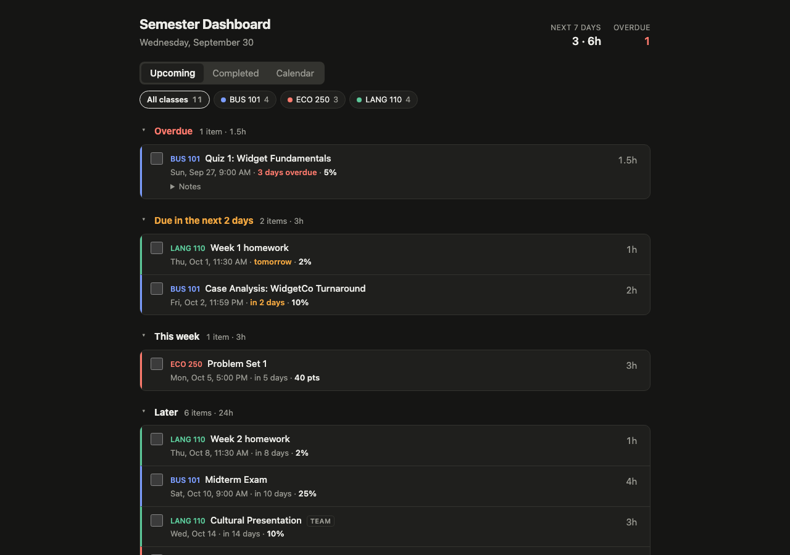
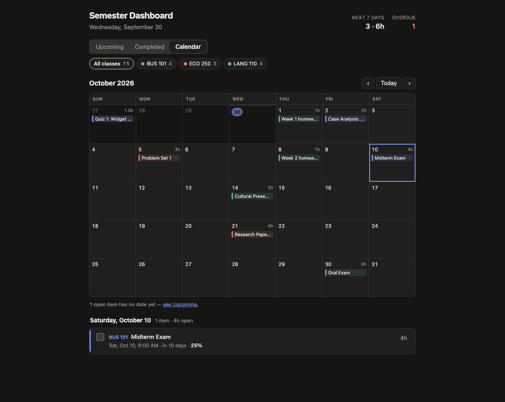
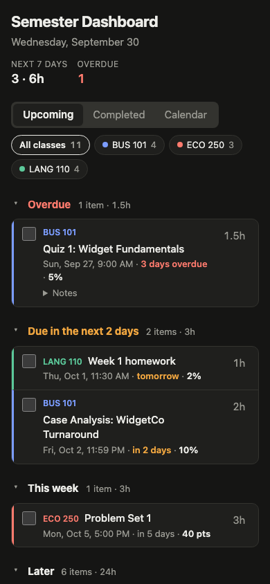

# Semester Dashboard

One place that answers **"what's due, how much is it worth, and how long
will it take me?"** across every class in a semester.

I built this for a Fall 2026 semester of seven classes whose deadlines were
scattered across PDF syllabi, a Word doc, and Canvas screenshots. The data is
curated once into YAML, and the app is a small local web app that ranks
everything by urgency, tracks what's done, and shows how many hours each
day's work will take.



<p>
  
  
</p>

<sub>Screenshots use the fictional sample data that ships with the repo.</sub>

## Features

- **Urgency groups:** Overdue, due in the next 2 days, this week, later, and
  no date yet, each with an item count and total hours.
- **Grade weight** (percent or points) on every item, so a 25% midterm
  doesn't look the same as a 2% homework.
- **Time estimates:** default hours per category (quiz, exam, paper, …) come
  from [`seed/estimate_rules.yaml`](seed/estimate_rules.yaml). Click the hours
  on any item to override them.
- **Check off** items as you finish them. Completed items move to their own tab.
- **Calendar view:** a month grid with class-colored items and open hours per
  day. Heavy days (6h or more) are flagged in red. Click a day to see and edit
  its items.
- **Class filter**, light and dark mode, and a layout that works at phone width.
- **TBD handling:** items whose dates aren't published yet stay visible
  instead of disappearing.
- **Automatic backups** of the database and your real data on every start and
  stop, into a synced folder of your choice (optional).

## Quick start

Requires Python 3.12+.

```bash
git clone https://github.com/fmbarrera/semester-dashboard.git
cd semester-dashboard
python3 -m venv .venv
.venv/bin/pip install -r requirements.txt
.venv/bin/python app.py
```

Open <http://localhost:8000>. A fresh clone loads the fictional sample
semester, with dates relative to today so the demo always looks current.
Interactive API docs are at <http://localhost:8000/docs>.

### Options

| Command | What it does |
|---|---|
| `python app.py` | Run on this computer only (the default, and safe on public wifi) |
| `python app.py --lan` | Also allow other devices on your network, e.g. your phone. **Trusted networks only.** |
| `python app.py --reseed` | Reload `seed/*.yaml` after editing it. Keeps completion state and hour overrides. |
| `python app.py --port 8080` | Use a different port |

> **There is no login.** Anyone who can reach the app can read and change the
> data. That's why it listens on `localhost` by default and `--lan` is opt-in.
> Don't expose it to the internet as-is. See
> [`docs/deployment-options.md`](docs/deployment-options.md) for safe ways to
> reach it from anywhere.

## Add your own semester

Your real data lives in two **gitignored** files next to the samples:

```
seed/courses.local.yaml       # your classes
seed/assignments.local.yaml   # your assignments
```

If both exist, the app uses them; otherwise it falls back to the sample pair.
They never get committed.

1. Copy the samples as a starting point:
   ```bash
   cp seed/courses.sample.yaml seed/courses.local.yaml
   cp seed/assignments.sample.yaml seed/assignments.local.yaml
   ```
2. Replace the contents with your classes and assignments. Use absolute
   `due_date: 2026-10-07` instead of the samples' relative `due_in_days`.
   A single assignment looks like this:
   ```yaml
   - id: bus101-midterm          # unique slug
     course_id: bus101           # must match a course id
     title: "Midterm Exam"
     category: exam              # picks the default hour estimate
     due_date: 2026-10-10        # or null if not published yet
     due_time: "09:00"
     weight_value: 25
     weight_unit: percent        # percent | points
   ```
   The full schema is in [`seed/README.md`](seed/README.md).
3. Load it: `python app.py --reseed`

The loader validates everything (unknown course or category, duplicate ids,
bad dates or times, …) and refuses to start with a clear error instead of
loading bad data.

A handy way to build these files is to give your syllabi to an AI assistant
along with `seed/README.md` and ask it for the two YAML files, then check
the result against the syllabi.

### Backups (optional)

```bash
cp config.example.yaml config.local.yaml   # gitignored
```

Set `backup_dir` to a synced folder (iCloud Drive, Dropbox, …). On every start
and on Ctrl+C, the app snapshots `data/dashboard.db` and your `*.local.yaml`
files there, skips the snapshot when nothing changed, and keeps the newest 30.
To restore, stop the app and copy a snapshot's `dashboard.db` into `data/`.

## How it works

```
seed/*.yaml ──(--reseed)──▶ SQLite (data/dashboard.db) ◀── FastAPI /api ◀── static HTML/JS
```

- **Backend:** [FastAPI](https://fastapi.tiangolo.com/) +
  [SQLModel](https://sqlmodel.tiangolo.com/) on SQLite.
  - `dashboard/models.py`: tables for courses, assignments, estimates, and
    estimate rules. Status is *derived* (done if `completed_at` is set, else
    TBD if the date isn't published, else upcoming), so un-checking an item
    never loses information.
  - `dashboard/seed.py`: validates and loads the YAML. Re-seeding keeps
    completion state and overrides by assignment id.
  - `dashboard/logic.py`: urgency buckets and sort order.
  - `dashboard/api.py`: JSON API under `/api` (`GET /api/assignments`,
    `PATCH /api/assignments/{id}`, …).
- **Frontend:** plain HTML, CSS, and JavaScript in `dashboard/static/`. No
  framework, no build step. The calendar is a hand-rolled month grid.

## Development

```bash
.venv/bin/pip install -r requirements-dev.txt
.venv/bin/python -m pytest -q
```

Tests run against copies of the sample seed files in a temp directory, so they
never touch real data.

Personal data is kept out of the repo in two ways: `.gitignore` covers
`seed/*.local.yaml`, `data/`, and `*.db`, and a
[gitleaks](https://github.com/gitleaks/gitleaks) pre-commit hook blocks
commits that contain secrets. Enable the hook with:

```bash
brew install pre-commit   # or: pip install pre-commit
pre-commit install
```

## Roadmap

- **Auto-spacing scheduler:** spread a big project's hours over the days
  before it's due, instead of piling them all on the due date
  ([PRD §7](PRD.md)).
- **Installable app + access from anywhere,** private and free. Options are
  in [`docs/deployment-options.md`](docs/deployment-options.md).

The full product spec is in [`PRD.md`](PRD.md).
